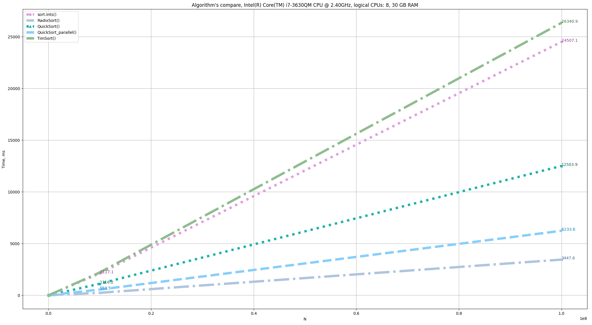

# Comparison of sorting algorithms in Golang

When we have any computer tool, we want to know how fast it is. This is a normal life situation.
In the case of Golang, we have a concurrency scheme. What is it? Will it be efficient, for example, to sort digits?
Concurrency and parallelism are not the same thing, but what can we have as a result of this?
If we build a sorting program by concurrency scheme, what effect can we expect?

## This experiment explores the following algorithms:

* sort.Ints() - standard sorting of integers.

* RadixSort() - this is not quite a sort in the sense that there is no function for exchanging values, however, RadixSort makes it possible
understand how fast you can "sort" integers.

* QuickSort() - implementation of quick sort.

* QuickSort_parallel() - implementation of a modified quicksort algorithm, where goroutines are naturally embedded where there is a recurrent call of the computational function. 

* TimSort() - implementation of Tim Peters's mergesort sorting algorithm.

<!---

Here we should then try to run this algorithm on a large data array, perhaps then the number of goroutines will become very large, this will be reflected in the time graph.

* Parallel schema #1, #2 - is the use of various Go approaches to synchronize calls of classic QuickSort() on chunks of the original array. 
Synchronization approaches were used, which could be googled on the Internet in about 10 minutes of searching.

--->

## Results

