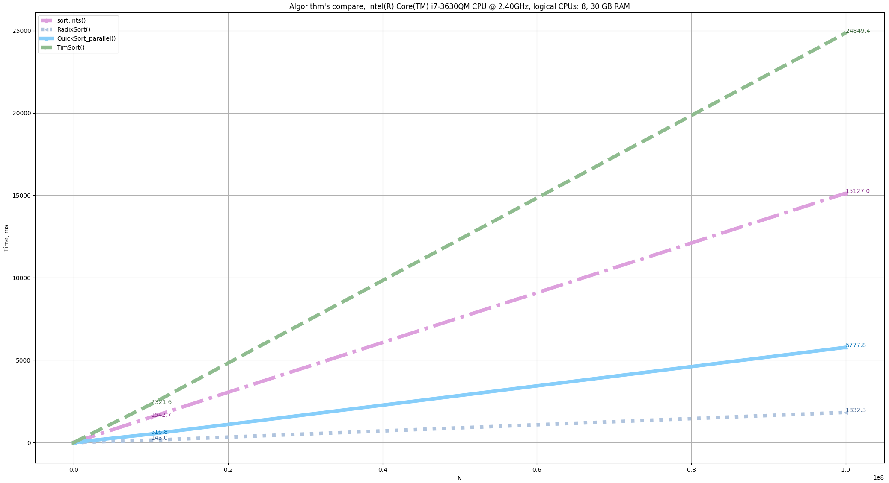

# Comparison of sorting algorithms in Golang

When we have any computer tool, we want to know how fast it is. This is a normal life situation.
In the case of Golang, we have a concurrency scheme. What is it? Will it be efficient, for example, to sort digits?
Concurrency and parallelism are not the same thing, but what can we have as a result of this?
If we build a sorting program by concurrency scheme, what effect can we expect?

## This experiment explores the following algorithms:

* **sort.Ints()** - standard sorting of integers.

* **RadixSort()** - this is not quite a sort in the sense that there is no function for exchanging values, however, RadixSort makes it possible
understand how fast you can "sort" integers.

* **QuickSort()** - implementation of quick sort.

* **QuickSort_parallel()** - implementation of a modified quicksort algorithm, where goroutines are naturally embedded where there is a recurrent call of the computational function. 

* **TimSort()** - implementation of Tim Peters's mergesort sorting algorithm.

<!---

Here we should then try to run this algorithm on a large data array, perhaps then the number of goroutines will become very large, this will be reflected in the time graph.

* Parallel schema #1, #2 - is the use of various Go approaches to synchronize calls of classic QuickSort() on chunks of the original array. 
Synchronization approaches were used, which could be googled on the Internet in about 10 minutes of searching.

--->

## Results

# The experiment for synthetic data.

By _synthetic data_, we understand the data generated using the random number generator according to the uniform distribution law.

* The parallel version of quicksort - **QuickSort_parallel()** implemented on goroutines demonstrates the best result among exchange sorts. If exchange sort is not required, then your choice is RadixSort().

# The experiment for "natural" data.

By _"natural" data_ we understand data taken from the real world, which are brought together into an integral system and generated by a certain logic of human use. 
The main feature of natural data is the empirical fact that the data is not extremely mixed, as is the case with synthetic data, and there are almost sorted ranges or ranges with close numbers in the arithmetic sense in the data.
In this particular case, the data is a sequence of integers as a result of the compact storage of the video data stream. 

* You can see, that the results are very strongly dependent on the length of the vectors.

* The big surprise for me was the empirical fact that **QuickSort()** turned out to be far from fast.

* **TimSort()** for vectors of dimension 10^8 did not show much advantage in comparison tests for data of different nature. 
* Standard sorting **sort.Ints()** worked better. 
* **RadixSort()** also performed better.

* **QuickSort()** is starting to lose.

* However, for sorting problems up to a vector length of 50000, **QuickSort()** can be a good choice.

* For sorting problems up to a vector length of 10000, **QuickSort()** is the best choice among exchange algorithms.

## What is the general conclusion?

You should carefully study the nature of the data and select a sorting algorithm for a specific sorting range to maximize the effect of the sorting algorithm, that is, to minimaze the time of run.
I think that RAM has to be spare much less often. These are production challenges.
